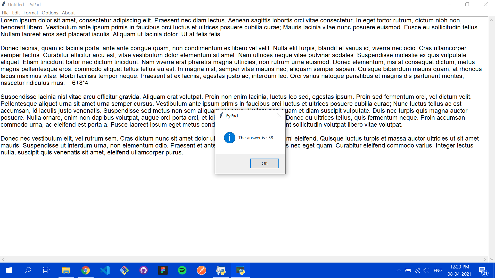
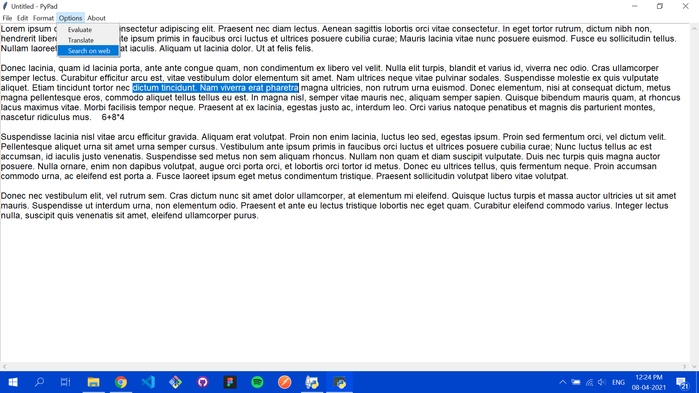
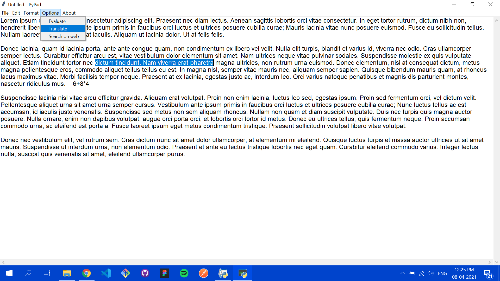
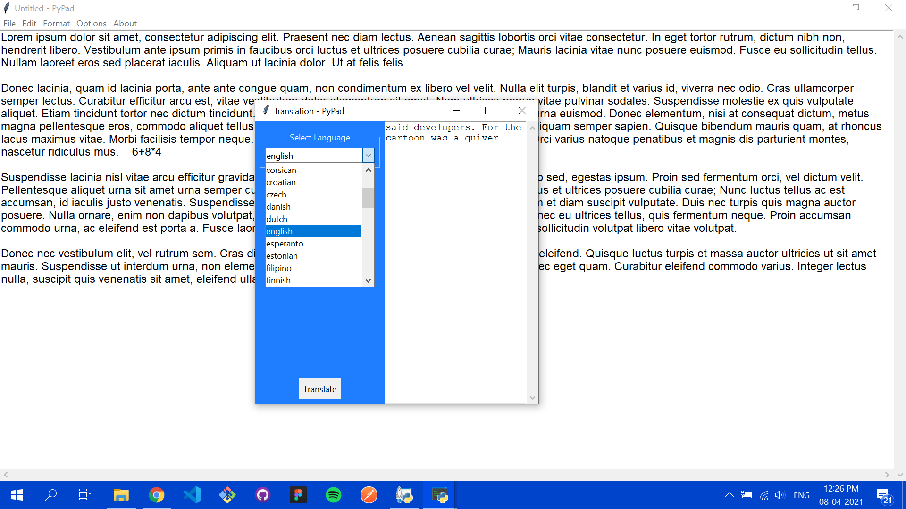
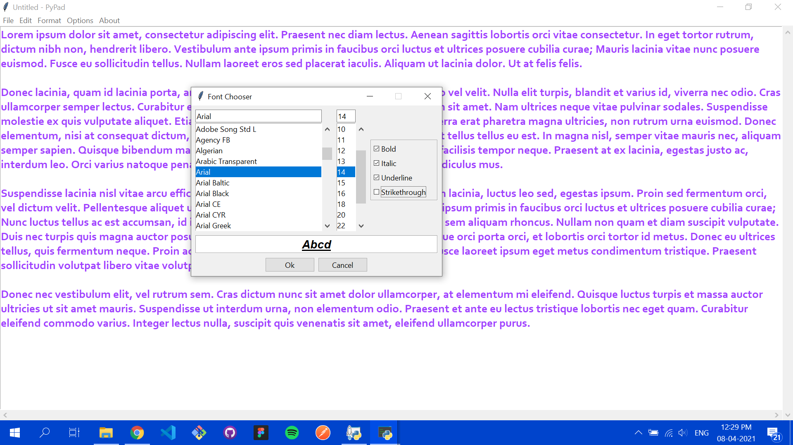

# PyPad
A Notepad like app written in Python with some additional features like <em>evaluating a selected simple expression, translating selected phrases and searching selected phrases on web.</em>

 

## Screenshots

